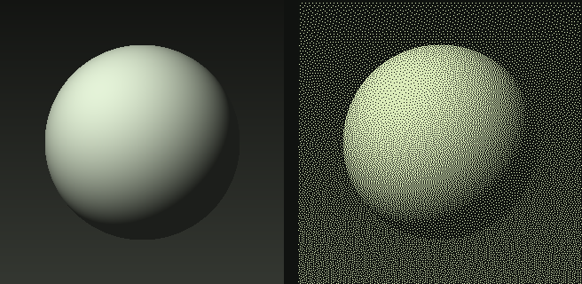

# Dither Studio

[](https://github.com/sergedoub/dither-studio/actions/workflows/ci.yml)

Turn images into dithers, limited-color artwork, and separated ink layers. Runs in your browser or as a standalone macOS app. Local editing needs no account, Photoshop installation, or cloud service.



## What it does

- 41 independent algorithm choices: error diffusion, Bayer matrices, and procedural screens.
- Mono, tonal, indexed-palette, and RGB modes; palette extraction and editing.
- Live previews, original/split comparison, image adjustments, sampling, and edge controls.
- Full-resolution PNGs with DPI metadata, grayscale masks, color-separation ZIPs, batch export, and portable JSON settings.

Inspired by [Dithertone Pro](https://www.doronsupply.com/product/dithertone-pro). This is an independent, unaffiliated implementation built from public feature descriptions, with its own code and demo artwork. Some effects are approximations; it is not a pixel-identical replacement. See [implementation and limitations](docs/limitations.md).

## Run from source

Requires Node.js 22.12 or later within the Node 22 release line, npm, and Git. `.nvmrc` selects Node 22. The browser edition targets current desktop browsers. macOS Apple Silicon is the tested desktop platform.

```sh
git clone https://github.com/sergedoub/dither-studio.git
cd dither-studio
npm ci
npm run build:web
npm run start:web
```

Open http://localhost:4782. Image processing runs on your device. Nothing uploads unless you explicitly configure and use the optional cloud library.

For the desktop app, run `npm start` from the same checkout. To build a macOS Apple Silicon app, run `npm run package`. Release downloads, when available, are on [GitHub Releases](https://github.com/sergedoub/dither-studio/releases). Desktop builds are unsigned and not notarized; managed Macs may disallow them. The browser edition is an alternative.

For web development, `npm run dev:web` starts Vite. The optional cloud API configuration is supplied by the production server, not the Vite development server.

## Use it

1. Open or drop PNG, JPEG, WebP, BMP, or GIF images. GIF imports use the first frame.
2. Choose an algorithm and rendering mode, then adjust the palette and sampling.
3. Compare the original and dithered preview; export PNG, mask, layers, or a batch ZIP.

Dither DPI controls sampling relative to Source DPI. At 72/300, a 1200-pixel source uses a 288-pixel dithering grid, expanded to its original size for export. Source DPI is entered manually; imported density metadata is not detected. Previews are capped at 1000 pixels and may differ from final full-resolution output.

Remove the demo from the queue before exporting a batch if you do not want it included. Settings can be saved and loaded as JSON. Command-O opens images, Command-S exports, Space shows the original temporarily, plus/minus zoom, and zero fits the image.

## Optional cloud storage

The Supabase integration is **experimental**. Its authenticated live storage round-trip has not been verified for this release. Local editing and downloads work without it. [Self-hosting instructions](docs/self-hosting.md) describe using your own Railway/Docker and Supabase resources. No maintainer credentials or project connection are required or bundled.

## Development and contributions

```sh
npm test
npm run format:check
npm run package
npm run verify:package
```

`npm test` builds the browser distribution before running the tests. See [CONTRIBUTING.md](CONTRIBUTING.md), [architecture](docs/architecture.md), and the [roadmap](docs/roadmap.md). This is a personal project maintained on a best-effort basis, with no support SLA. Discuss major changes before implementing them.

Report ordinary bugs through [issues](https://github.com/sergedoub/dither-studio/issues). Report vulnerabilities privately using [SECURITY.md](SECURITY.md).

## License

[MIT](LICENSE). Dependencies retain their own licenses; see [third-party notices](THIRD_PARTY_NOTICES.md). Original procedural demo artwork and project-created examples use the same MIT license.
